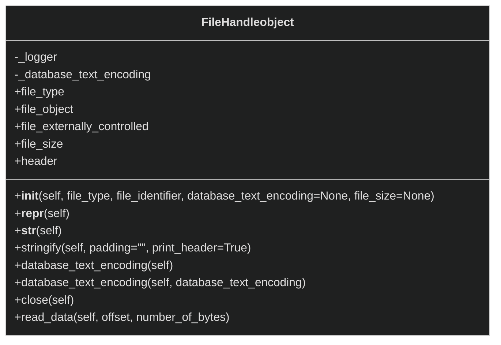

# sqlite_dissect.file

This package will control parsing and access to all (supported) sqlite files including the 
database, rollback journal, and wal.

- file_handle.py
- header.py
- utilities.py
- version.py
- version_parser.py

TODO items for the "file" package:

- [ ] Finish UML class diagrams.

 

### file_handle.py

This script holds the file handle for file objects to be worked with in relation to the database, wal, journal and other
supported file types specified in the FILE_TYPE file types list.

This script holds the following object(s):
- FileHandle(object)
  
  

TODO:
- [ ] Documentation improvements.
- [ ] Check variables against None and Type constraints, possibly by using descriptors and/or decorators.
    ##### FileHandle Class:
    - [ ] Handle the encoding differently (in particular the WAL file)?
    - [ ] Investigate a better way of cleaning up the file object other than having to explicitly call close.
    - [ ] The lock byte page is not implemented yet and therefore databases >= 1GB will fail to open.
    - [ ] Investigate if lock byte pages affect other SQLite file types such as WAL, journal, etc. at all.
    - [ ] Handle exceptions that may be raised from creating headers and reading data better.
    - [ ] Split the read_data function into separate read and seek functions?
  
 

### header.py

This script holds an abstract class for file header objects to extend and inherit from.  File headers such as that
of the wal, journal, and database file headers will extend this class.

>Note:
>  
> The database file header is the same as the file header for the sqlite database.  However, for cases like the wal 
> file, the file has a file header that is not related to the actual database information and then depending on how 
> many commits were done with the first page in them, could have many database headers.

This script holds the following object(s):
- SQLiteHeader(object)
  

TODO:
- [ ] Documentation improvements.
    ##### SQLiteHeader Class:
    -[ ] Investigate if there is a correct way to enforce class variables to subclasses.

### utilities.py
This script holds utility functions for dealing with the version classes rather than more general utility methods.

This script holds the following function(s):
- validate_page_version_history(version_history)
  

TODO:
- [ ] Documentation improvements.

 

### version.py
This script holds the superclass objects used for parsing the database and write ahead log.

This script holds the following object(s):
- Version(object)
  

TODO:
- [ ] Documentation improvements.
- [ ] Check variables against None and Type constraints, possibly by using descriptors and/or decorators.
- [ ] Investigate if there is a correct way to enforce class variables to subclasses.
    ##### Version Class:
    - [ ] Better exception handling when creating objects such as pages, etc.
    - [ ] Incorporate a get_page function?
    - [ ] Improve the (freelist/pointer map/master schema) page lists by making dictionaries?
    - [ ] Have a way to parse and store pages in the object itself?
    - [ ] get_b_tree_root_page: Check to make sure it is only a root page specified by the master schema or 1.
    - [ ] Document how the database_size_in_pages field is generated across different files and versions.
    - [ ] Check that rollback journals update the version valid for number and file change counter >= 3.7.0.
    - [ ] Have the database/version implement the commit record interface and rename it?  Rename version?
    - [ ] get_b_tree_root_page: Check if stored in memory for the version and if so return it instead of parsing.

 

### version_parser.py

This script holds the objects for parsing through the version history for master schema entries.  This can be used
for retrieving cells (records), carving, signature generation, etc..

This script holds the following object(s):
- VersionParser(object)
  

TODO:
- [ ] Documentation improvements.
- [ ] Check variables against None and Type constraints, possibly by using descriptors and/or decorators.
- [ ] Handle exceptions that may be raised from creating and working with objects better.
    ##### VersionParser Class:
    - [ ] Support the same master schema entry being removed and then re-added (Keep in mind row id).
    - [ ] How to handle master schema entries not found in specified versions (warning currently raised)?
    - [ ] Support for virtual table modules of master schema entry table type (warning currently raised).
    - [ ] Support for "without rowid" tables (index b-tree pages) (warning currently raised).
    - [ ] Investigate issues with same rows in index b-tree leaf pages that might get removed.
    - [ ] Either transition or also put the page_type field in the master schema entry.
